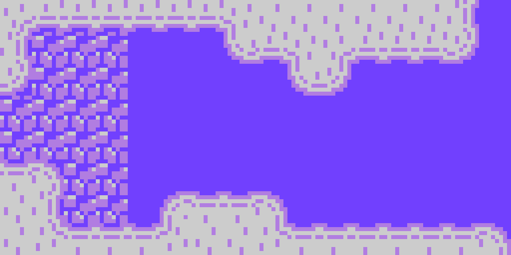

# lscapture
#### screen capture for LameStation

With this project, you can take screenshots of LameStation games! (epic!)

Included in this project is a test game that is already configured to take a 
screen capture (requires the LameStation SDK to build).

## Installation

Download the git repository and run `setup.py install` (requires *setuptools*).

    git clone https://github.com/lamestation/lscapture
    cd lscapture
    sudo python setup.py install

Add the path of the git repository to the PropellerIDE Spin path to make 
ScreenCapture accessible from any LameStation application.

## Usage

### Preparing an object

Include the `ScreenCapture` object and add a variable to store the address of 
the graphics buffer.

    OBJ
        cap     : "ScreenCapture"
    VAR
        word    buffer

Grab the buffer address during initialization.

    PUB Main
        lcd.Start(buffer := gfx.Start)

Pass the address to the `Capture` method to take a picture.

        cap.Capture(buffer)

It's a good idea to find a way to control it, otherwise your application will 
run very slowly and dump more pictures than you need. I usually put it behind
a button.

        if ctrl.A
            cap.Capture(buffer)}}

### Capturing an image

The easiest way is to use the `lscapture` python tool. Here's how to use it.

Get a list of available ports with `-l`.

    $ lscapture -l
    /dev/ttyUSB0
    /dev/ttyUSB1

Now run `lscapture` with the full port name to start the screen capture server.

    $ lscapture /dev/ttyUSB0
    Listening for capture input on port '/dev/ttyUSB0'...
    Receiving image download!
    Generating pic6.png...

lscapture will wait until it receives an image, then quit. You can also quit 
with `Ctrl+C`. It will generate PNG images with the name `pic###.png`, where
`###` is an incrementing number with leading zeroes, unless you use the `-o`
option to specify the output file name.

You can display the image after download with `-d`. It'll look awesome like 
this!

The `-s` option will scale the resulting image to different sizes. The default 
is `4x`.

    lscapture /dev/ttyUSB0 -s 8

    lscapture /dev/ttyUSB0 -s 1

For a full help, pass `-h`.

### Creating a video

You may end up with a large number of images and want to make an awesome video 
of it. You can use `ffmpeg` to do so; here is a decent one-liner.

    ffmpeg -r 30 -f image2 -s 1920x1080 -i pic%03d.png -vcodec libx264 -crf 25  -pix_fmt yuv420p out.mp4

The only thing you may want to change is `-r 30`, which is the frame rate, 
depending on the speed of your game.

Remember that on LameStation:

- Unlimited: up to ~70Hz
- `FULLSPEED`: ~30Hz
- `HALFSPEED`: ~15Hz
- `QUARTERSPEED`: ~7Hz

